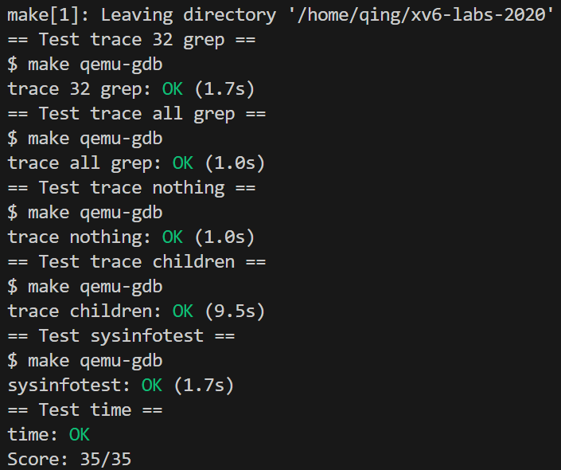

# pre-knowledge

我们需要在不同的应用程序之间、应用程序和操作系统之间有强隔离性，以保证操作系统不会因为bug而崩溃。

为了达到强隔离，可以采用以下的方法：

- **禁止应用直接访问敏感的硬件资源**，将资源抽象为服务。

  应用程序不能直接与CPU交互，只能与进程交互。所以，操作系统不是直接将CPU提供给应用程序，而是向应用程序提供“进程”，进程抽象了CPU，这样操作系统才能在多个应用程序之间复用一个或者多个CPU。

  进程使用 `exec` 来建立它们的内存映像，而不是直接与物理内存交互，这让操作系统来决定将进程放在内存中的哪个位置，如果内存紧张，操作系统甚至可能将进程的部分数据存储在硬盘上。

  文件系统抽象了磁盘。应用程序只能通过`open`，`read`，`write`，`close` 系统调用与存储交互，而不是直接读写磁盘。

  

- **禁止应用修改（甚至不能读取）操作系统的数据结构和指令**，而且，应用也不能访问其他进程的内存。

  CPU为这种强隔离提供了硬件支持。

  - 第一项硬件支持是：RISC-V中，CPU在**三种模式**下**执行指令**：user/kernel/machine mode

    - machine mode下执行的指令拥有全部特权；**CPU以machine mode启动**。machine mode主要用于配置计算机，xv6在machine mode下执行几行后，就切换到kernel mode。

    - kernel mode下，CPU被允许执行**特权指令**，例如允许和禁止中断。如果一个user mode下的应用尝试执行特权指令，那么CPU不会执行这个指令，它会切换到kernel mode，**终止该应用程序**，因为这个应用做了它不该做的事情。

    - 应用只能执行一般的指令（例如`add` 等），被称为运行在user space。kernel mode下的软件能够执行**特权指令**，被称为运行在kernel space。

    应用程序想要调用kernel的函数，必须切换到kernel mode。CPU提供了一个**特殊的指令**将CPU从user mode切换到kernel mode，并**在内核指定的入口进入内核**，RISC-V为这个目的提供了`ecall`指令，后跟的数字代表不同的系统调用。当切换到kernel mode，**内核就能验证系统调用的参数**（例如，检查传递给系统调用的地址是否是应用程序存储器的一部分），决定是否允许应用程序执行请求的操作，然后拒绝或执行它。
    
    **内核控制**user mode向kernel mode切换的入口这点非常重要：如果应用能够决定内核的入口，那么一个恶意应用程序可以在跳过参数验证的地方进入内核。
    
  - 第二项硬件支持是虚拟内存。
  
    page table将虚拟内存地址与物理内存地址做了对应。每一个进程都会有**自己独立的**page table，这样的话，每一个进程**只能访问出现在自己page table中的物理内存**。操作系统会设置page table，使得每一个进程都有不重合的物理内存，这样一个进程就不能访问其他进程的物理内存，因为其他进程的物理内存都不在它的page table中。


# scour code analysis

- 阅读`kernel/syscall.c`，试解释函数 `syscall()` 如何根据系统调用号调用对应的系统调用处理函数（例如`sys_fork`）？`syscall()` 将具体系统调用的返回值存放在哪里？

  ```c
  void syscall(void)
  {
      int num;
      struct proc *p = myproc();  // 获得当前进程
  
      num = p->trapframe->a7; 
      //当操作系统中断发生时（此处系统调用便会），处理器会保存当前的上下文信息到一个称为 "陷阱帧" (trap frame) 的数据结构中。在这个帧中，包含了各种寄存器的值，包括 a7 寄存器。
  
      if(num > 0 && num < NELEM(syscalls) && syscalls[num]) {  //NELEM是一个宏定义，表示数组中元素的数量
        // Use num to lookup the system call function for num, call it,
        // and store its return value in p->trapframe->a0
      	p->trapframe->a0 = syscalls[num]();
      } else {
      	printf("%d %s: unknown sys call %d\n",
          	p->pid, p->name, num);
      	p->trapframe->a0 = -1;
      }
  }
  ```

  可见 `syscall()` 是借用以下的静态数组调用 系统调用处理函数，将返回值放在了 `a0` 寄存器

  ```c
  // 将系统调用号与系统处理函数映射起来的静态数组，在 syscall.h 中从1开始定义  #define SYS_fork    1
  // to the function that handles the system call.
  static uint64 (*syscalls[])(void) = {
      [SYS_fork]    sys_fork,
      [SYS_exit]    sys_exit,
      ...           ...
  };
  ```


- 阅读`kernel/syscall.c`，哪些函数用于传递系统调用参数？试解释`argraw()` 函数的含义。

  - `fetchaddr` 函数从当前进程的内存中获取一个 `uint64` 类型的数据，并将结果存储在指针 `ip` 指向的位置。
  - `fetchstr` 函数从当前进程的内存中获取一个以空字符结尾的字符串，并将结果存储在缓冲区 `buf` 中。它返回字符串的长度（不包括空字符），如果发生错误则返回 -1。
  - `argraw` 函数返回当前进程的系统调用帧（trap frame）中第 n 个（n取0~5）寄存器的值。
  - `argint` 函数将`argraw(n)` 作为 32 位整数返回给指针 `ip`。
  - `argaddr` 函数将`argraw(n)` 作为指针返回给指针 `ip`。
  - `argstr` 函数将`argraw(n)` 作为以空字符结尾的字符串返回给缓冲区 `buf`，最多复制 max 个字符。它返回字符串的长度（包括空字符），如果发生错误则返回 -1。


- 阅读`kernel/proc.c`和`proc.h`，进程控制块存储在哪个数组中？进程控制块中哪个成员指示了进程的状态？一共有哪些状态？

  进程控制块是 `proc.h` 中定义的结构体 `struct proc` ，储存在 `proc.c` 的`struct proc proc[NPROC];` 结构体数组中，`NPROC ` 全称 Number of Processes。进程控制块中的 `enum procstate state; ` 即成员 `state` 指示进程状态，为 `enum procstate { UNUSED, USED, SLEEPING, RUNNABLE, RUNNING, ZOMBIE };`


- 阅读`kernel/kalloc.c`，哪个结构体中的哪个成员可以指示空闲的内存页？Xv6中的一个页有多少字节？

  ```c
  struct {
    struct spinlock lock;
    struct run *freelist;    //4096-byte
  } kmem;    //kernel memory
  ```

  `kalloc.c` 实现了一个简单的物理内存分配器，允许内核动态分配和释放物理内存页。


- 阅读`kernel/vm.c`，试解释`copyout(pagetable_t pagetable, uint64 dstva, char *src, uint64 len)`函数各个参数的含义。
  - 该函数会根据指定的页表，将给定长度的数据从内核中拷贝到用户空间的指定地址处。
  - `pagetable`是一个页表结构，用于指定要操作的页表。`dstva`是目标虚拟地址，表示要将数据拷贝到用户空间的起始地址。`src`是源数据的虚拟地址，表示要拷贝的数据在内核中的起始地址。`len`是要拷贝的数据的字节数。
  - 该函数实现了一个循环，每次迭代会将部分数据从内核拷贝到用户空间。在每次迭代中，首先会通过`walkaddr()`函数找到目标虚拟地址对应的物理地址。然后，使用`memmove()`函数将数据从内核中的起始地址拷贝到用户空间的对应位置。接着，更新剩余长度、源地址和目标虚拟地址，以便进行下一次迭代。


- 阅读 `user/user.h` and `user/usys.pl`，解释以上两个文件的作用是什么。
  - `user/user.h` 定义了用户态下 程序调用 系统调用函数接口， 即lab1写的众多utilities中调用的接口(system calls)
  - `user/usys.pl` 是一个Perl脚本，用于生成 `usys.S` 汇编代码文件， `usys.S` 中有调用所有 system call 的汇编代码，包括如下指令：
    - 首先，使用 `li` 指令将系统调用号（如"SYS_fork"）加载到`a7`中。
    - 然后，使用 `ecall` 指令触发系统调用。
    - 最后，使用 `ret` 指令返回。


- 总结出system call 从user space 到 kernel space 的全流程

  1. `user/user.h`：user mode 下程序调用 system call 函数 ，如 `fork()`时，会使用到其中的预定义，这些system call 函数会在kernel 中被具体实现
  
  2. `user/usys.S`：提供相应system call 的 `ecall` 指令，进入内核态
  
  3. `kernel/syscall.c`：到达内核态后调用 `syscall()`，处理所有的系统调用。`syscall()` 会根据传进来的系统调用编号，查询`syscalls[]`表，找到对应的内核函数并调用，如 `sys_fork`
  
  4. `kernel/sysproc.c`：到达 `sys_fork` 函数，其作用为封装kernel的各函数，执行具体的内核操作以完成系统调用
  
  通过以上过程，可以实现用户态和内核态的良好隔离。
  


# lab

- **summary**

  lab2中所关心的层次比lab1更深入一层，完整地体验了lab1 utility 中调用的 system call 是如何书写的。代码实现难度较低，但需要阅读理解较多源代码。

- [x] `System call tracing`
  1. 主要熟悉从user space 到 kernel space 的全流程
  2. 需要理解 mask 的含义与作用


- [x] `sysinfo`
  1. 在 `kernel/kalloc.c` 添加一个函数收集可用内存量
  2. 在 `kernel/proc.c` 中添加一个函数收集进程数
  3. 以上两个函数要在 `kernel/defs.h` 中进行声明
  4. 在 `kernel/sysproc.c` 中添加 `sys_sysinfo()` 函数，其中要使用 `copyout()` 将 kernel space 参数复制到 user space


<div align="center">

</div>
