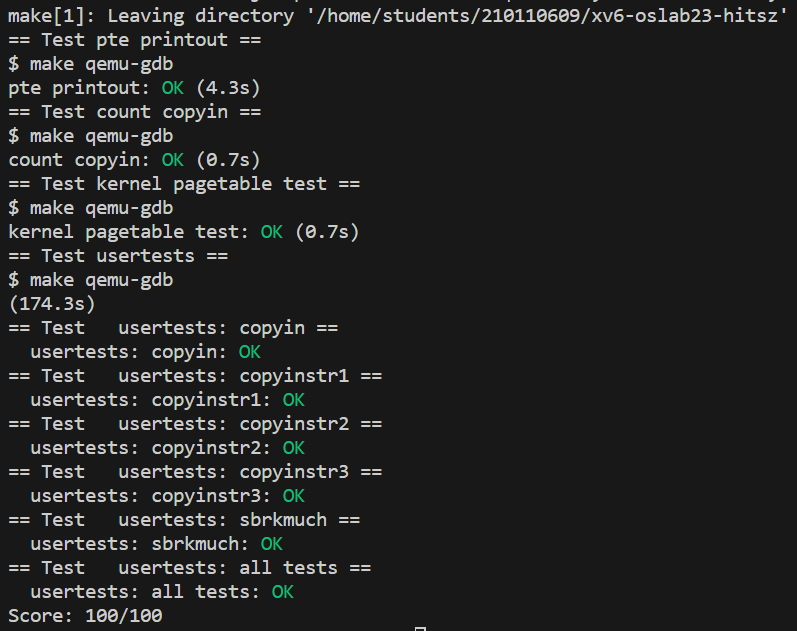

## page table

在我们使用的RSIC-V处理器上，虚拟内存的高25bit并没有被使用。这样的结果是限制了虚拟内存地址的数量，虚拟内存地址的数量只有$2^{39}$个字节，即512GB。在39bit中，有27bit被用来当做index，12bit被用来当做offset。offset必须是12bit，因为对应了一个page的4096个字节。

在RISC-V中，物理内存地址是56bit（设计者确定的）。所以物理内存可以大于单个虚拟内存地址空间，但是也最多到$2^{56}$字节。其中44bit是物理页号（PPN，Physical Page Number），剩下12bit是offset完全继承自虚拟内存地址（也就是地址转换时，只需要将虚拟内存中的27bit翻译成物理内存中的44bit的page号，剩下的12bitoffset直接拷贝过来即可）。

这样page table表会有多大呢？这个page table最多会有$2^{27}$个条目（虚拟内存地址中的index长度为27），这是个非常大的数字。所以实际上，page table是一个多级的结构。27bit的index，实际上是由3个9bit的数字组成（L2，L1，L0）。

页表的数据结构和翻译的模式图示大致如下：

<div align="center">
	
</div>


SATP寄存器会指向最高一级的page directory的物理内存地址，之后我们用虚拟内存中index的高9bit用来索引最高一级的page directory，这样我们就能得到一个PPN，也就是物理page号。这个PPN指向了中间级的page directory。

当我们在使用中间级的page directory时，我们通过虚拟内存地址中的L1部分完成索引。接下来会走到最低级的page directory，我们通过虚拟内存地址中的L0部分完成索引。在最低级的page directory中，我们可以得到对应于虚拟内存地址的物理内存地址。

PTE（Page Table Entry，即Directory中的一个条目）的构造如上图的下半部分所示。

- 第一个标志位是Valid。如果Valid bit位为1，那么表明这是一条合法的PTE，你可以用它来做地址翻译。否则，这个标志位告诉MMU，你不能使用这条PTE，因为这条PTE并不包含有用的信息。
- 下两个标志位分别是Readable和Writable。表明你是否可以读/写这个page。
- Executable表明CPU是否可以将页面内容解释为指令并执行它们。
- User表明这个page可以被运行在用户空间的进程访问。
- 其他标志位并不是那么重要，他们偶尔会出现，前面5个是重要的标志位。

这些标志位和所有其他与分页硬件相关的结构体都定义在`kernel/riscv.h`中


# lab

xv6对于每个进程的**用户地址空间**也有一个单独的页表，只包含该进程的用户内存的映射，从虚拟地址0开始。**因为内核页表不包含这些映射，所以用户地址在内核中是无效的**。

因此，当内核需要使用**在系统调用中传递的用户指针**（比如，传递给`write()`的缓冲区指针）时，内核**必须首先将指针转换为物理地址**。

本部分和下一部分的目标是**允许内核直接解引用用户指针**。

第二部分的目标就是让每一个进程进入内核态后，都能有**自己独立的内核页表**。第三部分的目标是在每个进程的内核页表中维护一个**用户态页表映射的副本**，使得内核态可以对用户态传进来的指针直接解引用。

相比原来的`copyin`的实现的优势是，原来的`copyin`是通过软件模拟访问页表的过程，将虚拟地址转换为物理地址的，而在进程内核页表中维护映射副本的话，可以**利用CPU的硬件寻址功能进行寻址**，效率更高，且**可以受快表加速**。

所以，需要在每一处**内核对用户页表进行修改的时候**，将同样的修改也**同步应用在进程的内核页表上**，使得两个页表的程序段（0到PLIC段）地址空间的映射同步。


- print a page table

  ```
  xv6 kernel is booting
  
  hart 1 starting
  hart 2 starting
  page table 0x0000000087f25000
  ||idx: 0: pa: 0x0000000087f21000, flags: ----
  ||   ||idx: 0: pa: 0x0000000087f20000, flags: ----
  ||   ||   ||idx: 0: va: 0x0000000000000000 -> pa: 0x0000000087f22000, flags: rwxu
  ||   ||   ||idx: 1: va: 0x0000000000001000 -> pa: 0x0000000087f1f000, flags: rwx-
  ||   ||   ||idx: 2: va: 0x0000000000002000 -> pa: 0x0000000087f1e000, flags: rwxu
  ||idx: 255: pa: 0x0000000087f24000, flags: ----
  ||   ||idx: 511: pa: 0x0000000087f23000, flags: ----
  ||   ||   ||idx: 510: va: 0x0000003fffffe000 -> pa: 0x0000000087f76000, flags: rw--
  ||   ||   ||idx: 511: va: 0x0000003ffffff000 -> pa: 0x0000000080007000, flags: r-x-
  init: starting sh
  ```
  
  打印如上一样的信息，相交于原版实验多了虚拟地址的计算，其中有如下实现：
  ```c
  va_new = va + i * (uint64)0x40000000;
  ```
  
  助教评：这里应该用移位运算，用乘法太不专业了。深以为然


- A kernel page table per process
  1. 修改`kernel/proc.h`中的 `struct proc`， 增加两个新成员：`pagetable_t k_pagetable;`和`uint64 kstack_pa;`，分别用于给每个进程中设置一个内核独立页表和内核栈的物理地址。
  2. 仿照`kvminit()` 函数重新写一个创建内核页表的函数。注意：不要修改全局的内核页表（kernel/vm.c中的`pagetable_t kernel_pagetable`），而是直接创建一个新的内核页表，并将其地址`k_pagetable`返回。实现的时候不要映射CLINT，否则会在任务三发生地址重合问题。
  3. 把`procinit()`中内核栈的物理地址`pa`拷贝到PCB新增的成员`kstack_pa`中，同时还需要保留内核栈在全局页表`kernel_pagetable`的映射，然后在Step 4 `allocproc()`中再把它映射到进程的内核页表里。
  4. 修改`allocproc`函数。`allocproc()`会在系统启动时被第一个进程和`fork`调用。在`allocproc`函数里调用Step 2 创建的函数设置内核页表，并且参考借鉴`kvmmap`函数将Step 3 设置的内核栈映射到页表`k_pagetable`里。
  5. `scheduler()` 是cpu调度，执行进程的函数，因此在 `swtch(&c->context, &p->context);` 前需要将进程的内核页表地址放在 `satp` 寄存器中，执行完进程后也要将 `satp` 寄存器中的地址切换回全局内核页表的地址
  6. 修改`freeproc()`，当进程结束时释放对应的内核页表。注意不能释放叶子页表指向的物理页。


- Simplify copyin/copyinstr
  1. 写一个`sync_pagetable`函数把进程的用户页表映射到内核页表中，同时在defs.h中声明。**推荐一种较为优雅的实现方法** ：内核页表直接共享用户页表的叶子页表，即内核页表中次页表的部分目录项直接指向用户页表的叶子页表。
  
     ```c
     void sync_pagetable(pagetable_t uvm, pagetable_t kvm) {
       // 次级页表号为0~95号，因此全在0号页目录表上
     
       pagetable_t upgtbl_sec;
       pagetable_t kpgtbl_sec;
       pte_t *pte_k = &kvm[0];
       pte_t *pte_u = &uvm[0];
     
       // 若用户页表无二级页表，直接返回
       if (*pte_u & PTE_V) 
         upgtbl_sec = (pagetable_t) PTE2PA(*pte_u);
       else return;
     
       // 若内核页表无二级页表，申请后添加到内核页表
       if (*pte_k & PTE_V) {
         kpgtbl_sec = (pagetable_t) PTE2PA(*pte_k);
       } else {
         kpgtbl_sec = (pagetable_t) kalloc();
         if(kpgtbl_sec == 0) panic("sync_pagetable: kalloc");
         memset(kpgtbl_sec, 0, PGSIZE);
         *pte_k = PA2PTE(kpgtbl_sec) | PTE_V;
       }
     
       // 将用户页表的96个次级页表项复制到内核页表中
       for (int i = 0; i < 96; i ++ ) {
         kpgtbl_sec[i] = upgtbl_sec[i];
       }
     
     }
     ```
  
  2. 用函数 `copyin_new()` （在 `kernel/vmcopyin.c`中定义）代替 `copyin()` （在 `kernel/vm.c`中定义）。用 `copyinstr_new()` 以代替 `copyinstr()`。
  
  3. 标志位User一旦被设置，内核就不能访问该虚拟地址了。因此在调用`copyin_new()`/`copyinstr_new()`之前修改sstatus寄存器的SUM位：`w_sstatus(r_sstatus() | SSTATUS_SUM);` 在调用`copyin_new()`/`copyinstr_new()`之后去掉sstatus寄存器的SUM位：`w_sstatus(r_sstatus() & ~SSTATUS_SUM);`
  
  4. 在独立内核页表加上用户页表的映射的时候，每一次用户页表被修改了映射的同时，都要修改对应独立内核页表的相应部分保持同步。这通常在`fork()`, `exec()`, `sbrk()`中发生，其中`sbrk()`调用`growproc()`来实现内存分配或回收。也就是，需要在`fork()`、`exec()`和`growproc()`这三个函数里将改变后的进程页表同步（调用`sync_pagetable`函数）到内核页表中。
  
  5. 注意：第一个进程也需要将用户页表映射到内核页表中（调用`sync_pagetable`函数），见kernel/proc.c: userinit()。
  
<div align="center">
	
</div>
​     
