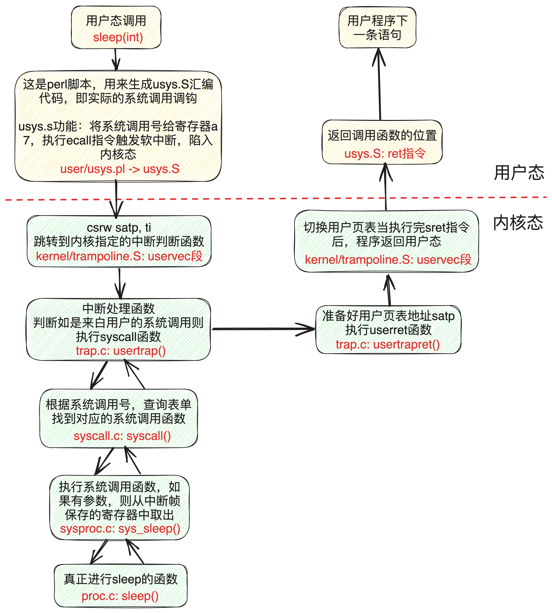
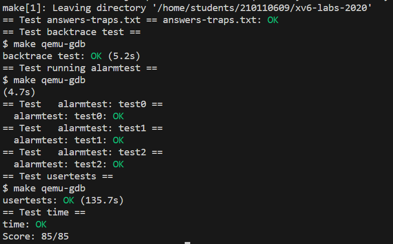

## 背景知识

### trap 流程

每当

- **系统调用**，这时用户程序执行`ecall`指令，来让内核为它做一些事情。
- **异常**，一个**指令**（用户指令或内核指令）做了一些非法的事情，比如说除以0或者使用无效的虚拟地址
- **设备中断**，当**设备发出信号**表明该设备需要关注时，比如当磁盘硬件完成了读或写请求时

都会发生用户空间和内核空间的切换 ，这通常被称为trap。为了方便代码实现，又分为来自user space的`traps`、来自kernel space的`traps`和定时器中断。

xv6的`trap`处理分四个阶段进行：

1. RISC-V CPU采取的硬件动作
2. 为内核C代码做准备的一些**汇编指令**
3. 通过C语言函数`trap handler`决定怎么处理这个`trap`
4. 系统调用或设备驱动程序服务例程

处理`trap`的内核代码（汇编或C）通常被称为处理程序（`handler`）；第一个`handler`指令通常用**汇编**（而不是C）编写，通常被称为`vector`。


### RISC-V trap机制

每个RISC-V CPU都有一组**控制寄存器**，内核通过**写入这些寄存器**来告诉CPU如何处理`trap`  主要寄存器的说明`(kernel/riscv.h)`：

- `stvec`：`trap`的`handler`地址，RISC-V跳转到`stvec`中的地址来处理`trap`
- `sepc`：当`trap`发生时，RISC-V将**程序计数器**保存在这里
- `scause`：RISC-V将引发`trap`的原因编号保存在这里
- `sstatus`：`sstatus`中的SIE位控制了**是否启用设备中断**。如果内核清除了SIE（不设置SIE），RISC-V将推迟设备中断，直到内核设置SIE。SPP位表示`trap`来自user mode 还是supervisor mode，并控制`sret`返回到哪种模式

注意，以上寄存器只有在supervisor mode时才可读写


RISC-V硬件对所有`trap`类型（除了定时器中断）执行以下步骤：

1. 如果`trap`是设备中断，并且`sstatus`中的SIE位未设置，则不再执行以下任何操作
2. 通过将`sstatus`中的SIE位清除，来**禁止中断**
3. 将`pc`（程序计数器）拷贝到`sepc`中
4. 将当前模式（user或supervisor）保存在`sstatus`的SPP位
5. 设置`scause`，来反映`trap`触发的原因
6. 将模式设置为supervisor
7. 将`stvec`拷贝到`pc`
8. 在新的`pc`处开始执行（开始执行`trap handler`）

注意，CPU**不会切换到内核页表**，**不会切换到内核栈**，也**不会保存除`pc`外的任何寄存器**。内核软件必须完成这些工作。CPU在`trap`过程中**只做最少工作**的一个原因是：**为软件提供灵活性**。比如，一些操作系统在某些情况下**通过省略页表切换**，来提高`trap`的性能。


### 来自用户空间的Traps

如果用户程序进行系统调用（`ecall`指令），或做了非法的事情，或者设备中断，那么在用户空间执行时可能会发生`trap`。

来自用户空间的`trap`的高层路径是：`uservec(kernel/trampoline.S)`，然后是`usertrap(kernel/trap.c)`；返回时，`usertrapret(kernel/trap.c)`，然后`userret(kernel/trampoline.S)`

`trampoline`页面用于在用户页表和内核页表之间进行映射（在内核页表和每个用户页表中，trampoline页面都映射到相同的虚拟地址TRAMPOLINE），以便`trap handler`可以在切换页表后继续执行。`uservec`负责保存用户寄存器的状态，将`satp`切换到内核页表，并调用`usertrap`，后者确定trap的原因并采取相应的操作。最后，`usertrapret`和`userret`函数用于恢复寄存器状态，并将控制权返回到用户空间。

以下是一个系统调用引发trap的例子（来源：https://hitsz-cslab.gitee.io/os-labs/lab2/part2.assets/syscall.png）

<div align="center">
	
<dic/>


### 来自内核空间和定时器的Traps

由于trap来自kernel，因此也就免除来自user space的很多麻烦。`kernelvec(kernel/kernel.S)`将寄存器保存在被中断的内核线程的堆栈上后，`kernelvec`跳转到`kerneltrap(kernel/trap.c)`。`kerneltrap`用于处理设备中断和异常两种类型的trap。它调用`devintr(kernel/trap.c)`来检查和处理设备中断。如果trap不是设备中断，则它一定是异常，对于xv6内核来说，异常通常表示严重错误，内核将调用panic函数并停止执行。

如果`kerneltrap`是由定时器中断调用的，并且进程的内核线程A正在运行，则`kerneltrap`会调用yield，将执行机会让给其他线程。在某个时刻，占据CPU的一个线程将退出，使之前的线程A重新开始。

当`kerneltrap`完成工作后，它需要返回到被trap中断的代码。由于yield函数可能会干扰`sepc`和`sstatus`，因此`kerneltrap`在启动时保存它们。现在，它恢复这些控制寄存器，然后返回到`kernelvec`。`kernelvec`从堆栈中弹出保存的寄存器，并执行`sret`。`sret`会将`sepc`复制到`pc`，并恢复被中断的内核代码。


## lab

- `RISC-V assembly`

  一些与 `risc-v` 相关的汇编问题，比较简单，见 `answers-traps.txt` 

- `Backtrace`

  类似`gdb`中的`backtrace`，要求在 `sys_sleep` 中插入对`backtrace`的调用，然后测试

  hints：

  - GCC编译器将当前执行函数的帧指针（the frame pointer）存储在寄存器`s0`中

    ```c
     static inline uint64
     r_fp()
     {
       uint64 x;
       asm volatile("mv %0, s0" : "=r" (x) );
       return x;
     }
    ```

    上述函数可用来读取当前帧指针，其中的`asm`内联汇编表达式`"=r" (x)`表示`x`的值要从寄存器`r`中获取

  - the layout of stack frames：

    - the return address lives at a fixed offset (-8) from the frame pointer of a stackframe
    - the saved frame pointer lives at fixed offset (-16) from the frame pointer.

  - xv6在页面对齐的地址上为xv6内核中的每个堆栈分配一个页面。可以使用`PGROUNDDOWN(fp)`和`PGROUNDUP(fp)`来计算堆栈页面的顶部和底部地址（见`kernel/riscv.h`）这些数字有助于回溯结束其循环。

  因此可以如下实现`backtrace`

    ```c
    void
    backtrace(void)
    {
      uint64 fp = r_fp();
      // 由于栈高位为新调用的，低位为旧的，因此一路向栈底找
      // 如果已经到达栈底，则停止
      while(fp != PGROUNDDOWN(fp)) { 
        uint64 ra = *(uint64*)(fp - 8); // 返回地址
        printf("%p\n", ra);
        fp = *(uint64*)(fp - 16); // 找到上一个fp
      }
    }
    ```


- `Alarm`

  本任务将实现**用户级中断/错误处理程序**的基本形式。向xv6添加一个特性，该特性在进程使用「CPU时间」时定期向进程发出alarm，这对于希望限制消耗多少「CPU时间」的进程，或者希望采取一些周期性操作的进程来说可能很有用
  
  如果要实现以上要求，需要以下流程：
  
  1. 用户程序通过系统调用`sigalarm(interval, handler)`设置`alarm`间隔和`alarm handler` ，系统调用将其保存在`PCB`中
  2. 当计时器中断发生时，陷入内核，调用`usertrap()`，在`usertrap()`中，若发现是计时器中断，那么会进行相应的判断处理，如果满足要求，则会在备份`trapframe` 后返回到**用户空间**执行`alarm handler `函数。
  3. 执行`alarm`处理函数后，调用**系统调用**`sigreturn`，表明要返回到计时器中断发生前的执行序列。
  4. 再次陷入内核，调用`usertrap()`，发现是因为系统调用中断，那么就调用相应的系统调用函数`sys_sigreturn`，在系统调用中根据备份的`trapframe`进行恢复。
  
  
  
  重要实验步骤：
  
  1. 添加`sigalarm`和`sigreturn`系统调用，原理与lab2相同
  
  2. 在`kernel/proc.h`中添加`alarm`相关成员，用来存储：`alarm`间隔、指向`handler`函数的指针、距上次alarm多少`ticks`、handler flag、`trapframe` 指针。即如下：
  
     ```c
     struct proc {
          ...
          // alarm 相关成员
          int alarm_interval;          // alarm间隔（如果为0，表示禁用alarm）    
          void (*alarm_handler)();     // 函数指针
          int alarm_ticks;             // 距离上次alarm过了多少ticks
          int handler_is_return;       // flag，如果有handler程序没有返回，内核不应该再次调用它
          struct trapframe* alarm_trapframe; // 用于handler处理完之后恢复原程序的正常运行
     };
     ```
  
  3. 在`kernel/proc.c`的`allocproc()`中初始化`PCB`中新增的`alarm`相关字段，同时在`freeproc()`中释放
  
  4. 在`kernel/trap.c`中实现拷贝`trapframe`的函数，当调用`handler` 函数前，拷贝到`PCB`中，当`sigreturn`被调用时，通过`PCB`备份的`trapframe`进行恢复
  
  5. 实现`sigalarm`和`sigreturn`系统调用
  
  6. 修改`kernel/trap.c`的`usertrap`，使得计时器中断发生时，即每个`tick` 后，进行相应判断，即：是否禁用了`alarm`？`alarm`的间隔是否到期？如果到期了，就应随后调用`handler`函数，不过应该事先判断是否有`handler`正在运行。

<div align="center">
	
<dic/>