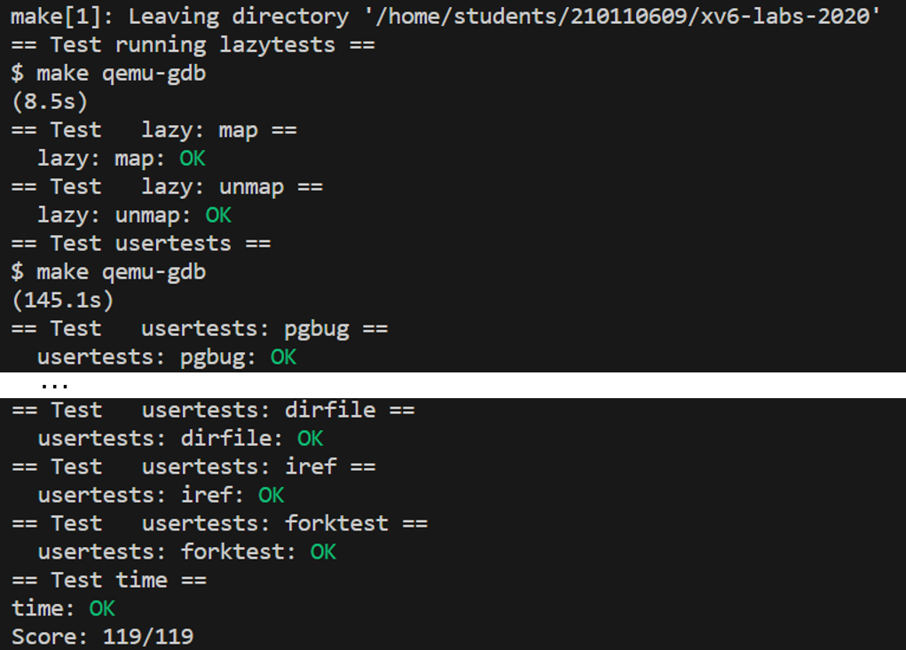

## Page-fault exceptions

xv6对异常的响应非常无聊：如果异常发生在用户空间，内核会杀死出错的进程。如果内核发生了异常，内核会`panic`。真正的操作系统通常会有更多有趣的响应方式。RISC-V有三种类型的页错误异常（Page-fault exceptions）：**加载页面错误**（当load指令不能翻译虚拟地址时），**存储页面错误**（当store指令不能翻译虚拟地址时），**指令页面错误**（当程序计数器中的地址不能翻译时）。`scause`寄存器中的值表示页错误的类型，`stval`寄存器包含了无法翻译的地址。以下介绍页错误异常能实现的几大功能。


- 写时复制 Copy-on-Write Fork（COW fork）

  `fork` 会使子进程的初始内容与父进程内容相同。xv6用`uvmcopy(kernel/vm.c)`实现`fork`，其为子进程分配物理内存，并将父进程的内存复制到其中。但这样会造成较大开销，有时会造成巨大浪费。比如：`fork` 后马上调用 `exec` 。

  如果子进程能与父进程共享父进程的物理内存，这个过程将更高效。这意味着不需要额外开销去分配物理内存并复制。如果这样，当父子进程同时读时，是可行的，但当它们向共享的栈或者堆写入时，双方的执行都会被打乱。因此，我们可以采取以下策略：

  - 父子进程最初共享所有的物理页面，但是每个页面都将它们映射为只读（清除`PTE_W`标志），即只可读

  - 如果任何一个进程写了一个给定的页面（执行store指令），RISC-V CPU就会产生一个页面错误异常。内核的`trap handler`通过分配一个新的物理内存页面，并将**出错地址所映射到的物理页面进行拷贝**，将其拷贝到新的物理页面中。

  - 内核更改出错进程的页表中的相关PTE，以指向新的物理页面，**并允许读写**，然后在导致错误的指令处继续执行出错的进程。因为PTE允许写入，所以重新执行的指令现在将无错误地执行。

  写时复制使fork更快，因为fork不需要复制内存了。当写入时，一些内存将不得不在以后被复制，但是通常情况下，大部分的内存从来没有被复制过。

  写时复制需要 book-keeping（对内存页面的引用计数进行跟踪和管理的操作）来**帮助决定何时可以释放物理页面**，因为**每个页面可以被不同数量的页表引用**，这取决于 forks，页错误，execs 和 exits。book-keeping 允许一个重要的优化：如果一个进程发生存储页面错误，并且**物理页面只从该进程的页表中引用**，则不需要复制。
  
- 懒分配 lazy page allocation
  
  - 当应用程序调用`sbrk`请求更多内存时，内核会注意到进程内存大小的增加，但**不会分配物理内存**，也**不会为新的虚拟地址范围创建PTE**。而只是记住分配了哪些用户地址，并**在用户页表中将这些地址标记为无效**。
  - 当进程第一次尝试使用任何给定的懒分配的内存页时，CPU会产生一个页面错误，内核通过分配物理内存、清零和映射来处理这个错误。 

  因为**应用程序经常申请比实际需求更多的内存**，所以懒分配非常有效：内核只在应用**真的用到内存时**才给它分配，内核不需要为应用程序从不使用的页面做任何工作。 像 COW fork 一样，内核可以对应用透明地实现懒分配。
  
  如果应用程序要求大量增加地址空间，那么没有懒分配的`sbrk`是十分昂贵的。懒分配允许这种成本随着时间的推移而分散。另一方面， 懒分配会导致页面错误的额外开销，这涉及到 内核态/用户态的转换。操作系统可以通过**为每个页面错误分配一批连续的页面而不是一个页面**，并通过**为这种页面错误指定内核进入/退出的代码**来降低这一成本。
  
- 虚拟内存
  
  虚拟内存其实也是使用到了页错误异常，当发生缺页时才从下一级存储介质中调取上来。
  
  
  

## lab

本次 lab 分为三个部分，但其实都是属于同一个实验的不同步骤

- `Eliminate allocation from sbrk()`

  修改`kernel/sysproc.c` 的`sys_sbrk()`。 `sbrk(n)` 系统调用将进程内存大小增加 n 个字节，然后返回新分配的区域的开始，即增加前的`myproc()->sz` 。懒分配版本的 `sbrk(n)` 也应该增加进程大小，即对`myproc()->sz` 操作，并返回新分配的区域的开始。但不会实际分配内存，即删除对 `growproc() `的调用。
  
- `Lazy allocation`

  删除实际分配内存后，启动xv6后执行`$ echo hi` 会得到：
  ```
  usertrap(): unexpected scause 0x000000000000000f pid=3
              sepc=0x00000000000012a4 stval=0x0000000000004008
  panic: uvmunmap: not mapped
  ```
  
  任务二要求修改 `trap.c` 中的代码，分配新的物理内存页并映射到之前出错的虚拟地址，从而响应来自用户空间的页面错误，然后返回到用户空间，让进程继续执行。实验步骤为：
  
  1. 修改 `usertrap()` ，使其判断出页错误后分配内存，其中，判断页错误可以通过查看`r_scause()`是13或是15实现。分配内存需要参考`uvmalloc()`中如何调用`kalloc()`和`mappages()`
  
     提示：
  
     - `r_stval()`返回RISC-V `stval`寄存器，其中包含导致页面错误的虚拟地址。
     - 使用`PGROUNDDOWN(va)`将**出错的虚拟地址**四舍五入到页面边界
  
  2. 修改`uvmunmap()`，使其不再"panic"。如果进程没有真正地分配物理内存，当进程退出时，调用`uvmunmap`来回收分配的页面时不应该"panic"

- `Lazytests and Usertests`

  实质上就是对已经初步完成的懒分配进行完善，包括：

  1. 修改`sys_sbrk()`，处理负的`sbrk()`参数，如果`n`为负则直接释放空间

     ```c
     if(n < 0) {
     	uvmdealloc(myproc()->pagetable, myproc()->sz, myproc()->sz + n);
     }
     ```

  2. 修改 `usertrap()` 如果一个进程的虚拟内存地址**高于**使用`sbrk()`分配的任何虚拟内存地址，则终止该进程

     ```c
     if(va >= p->sz)   //注意一定是>=，要取等
     	p->killed = 1;
     ```

  3. 处理用户堆栈下面的无效页上的错误（如果是保护页的错误，应该终止进程）

     hint：`guard page` 在栈下面，栈只有一页的大小，`PGROUNDDOWN(p->trapframe->sp)`就是栈底

  4. 修改`fork()`中调用的`uvmcopy()`函数，由于父进程的内存可能并没有被分配，因此当PTE不存在或者无效时，不"panic"

  5. 修改`kernel/vm.c`中的`walkaddr`函数。`walkaddr` 函数功能是将`va` 转换为`pa` ，该函数可被用来从用户空间虚拟地址读写数据，如果该虚拟地址没有被分配内存，则会出现错误。因此要进行对应的修改，否则 `sbrkarg` 测试不通过，即无法向已分配的mem读写。 


<div align="center">
	
</div>

