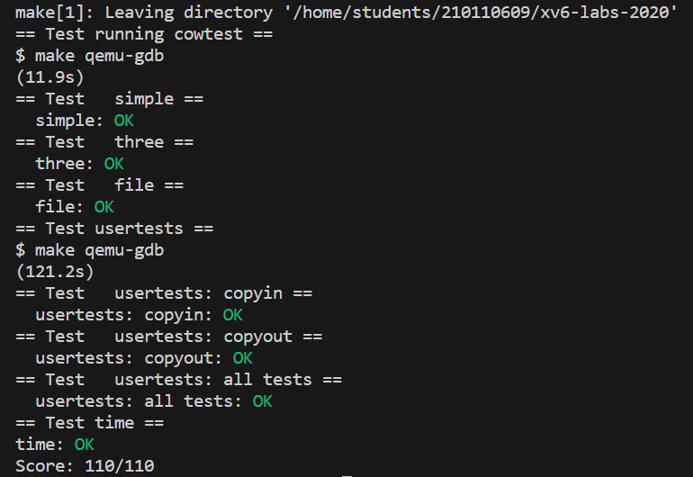

背景知识已在 [lab5实验说明文档](./lab5.md) 中提到，本实验就是要实现写时复制，在此引用官网指导书原文的中文翻译简述写时复制实现方案

> copy-on-write (COW) fork()的目标是推迟到子进程实际需要物理内存拷贝时再进行分配和复制物理内存页面。
>
> COW fork()只为子进程创建一个页表，用户内存的PTE指向父进程的物理页。COW fork()将父进程和子进程中的所有用户PTE标记为不可写。当任一进程试图写入其中一个COW页时，CPU将强制产生页面错误。内核页面错误处理程序检测到这种情况将为出错进程分配一页物理内存，将原始页复制到新页中，并修改出错进程中的相关PTE指向新的页面，将PTE标记为可写。当页面错误处理程序返回时，用户进程将能够写入其页面副本。
>
> COW fork()将使得释放用户内存的物理页面变得更加棘手。给定的物理页可能会被多个进程的页表引用，并且只有在最后一个引用消失时才应该被释放。

## lab

- ` Implement copy-on write`

  实验步骤如下：

  1. 修改`uvmcopy()`将父进程的物理页映射到子进程，而不是分配新页。如果父进程的PTE可写，则改为不可写，并标识`PTE_COW` 。
  
     > You can use the RSW (reserved for software) bits in the RISC-V PTE for this.
  
     `PTE_COW` 即RSW，需要在 riscv.h 中定义：`#define PTE_COW (1L << 8)`
  
  2. 在 `usertrap()` 中捕捉 page fault，在尝试修改页的时候，执行复制操作
  
     ```c
     else if (r_scause() == 15 && uvmcheckcowpage(r_stval())){
     	// 如果内存不足，则杀死进程
         if(uvmcowcopy(r_stval()) < 0)
         	p->killed = 1;
     // r_scause() == 15表示Store/AMO page fault；13表示Load page fault
     ```
  
     在实现 `uvmcowcopy` 时，要注意何时才进行新建页面。若一个页面有多次引用，当前则按照进程的调度顺序，先执行`uvmcowcopy`的进程先创建新页，若只剩1次引用时，就不需要再创建新页，只需消除`PTE_COW`，恢复`PTE_W`。并且，只有执行 `uvmcowcopy` 的进程会更改映射，其余不受影响，仍保持对原先页面的映射。
  
     ```c
     acquire(&reflock);
     // 当子进程已经cow后，父进程并不需要再操作一次，应仍保持之前的引用
     // 若有多次引用，则当前涉及到的进程全部创建新页，消除cow，其余不受影响
     if(refcount[REF_NUM(pa)] <= 1) {
     release(&reflock);
     return pa;
     }
     ```
  
  3. 类似lazy allocation的`copyin()` （或者说其中的`walkaddr()`），由于是软件模拟访问页表，不会触发缺页异常，所以需要手动添加同样的写时复制逻辑。
  
  4. 实现引用计数，以确保每个物理页在最后一个PTE对它的引用撤销时被释放。
  
     - 当`kalloc()`分配页时，将页的引用计数设置为1；当`fork`导致子进程共享页面时，增加页的引用计数；当写时复制时，需要将新页引用计数置为1，并将原页引用计数减1。每当任何进程从其页表中删除页面时，减少页的引用计数，`kfree()`只应在引用计数为零时将页面放回空闲列表。
     - 将这些计数保存在一个固定大小的整型数组中。页面位于物理地址空间，即 `from physical address 0x80000000(KERNBASE) to PHYSTOP` ，因此数组大小为 `(PHYSTOP-KERNBASE)/PGSZIE` 。在修改该数组时，为保证正确性，可加上自旋锁。该数组并不需要初始化，其被第一次用到时会置1。


- bug：
  
  ```c
  // kalloc()
  ...
      if(r){
          memset((char*)r, 5, PGSIZE); // fill with junk
          // acquire(&reflock);
          refcount[REF_NUM(r)] = 1;
          // release(&reflock);
      }
  ...
  /* 不能acquire，这个时候还没kinit  */
      
      
  // kfree()
  ...
      acquire(&reflock);
      if(--refcount[REF_NUM(pa)] <= 0) {
          //释放页面
          ...
      }
  	release(&reflock);
  ...
  /* 为什么 --refcount[REF_NUM(pa)] == 0 就直接卡死？*/
  /* 经过打印，xv6启动时，free掉的页面计数都是-1，其原因或许是因为kinit()时先kfree全部页面，
     即： freerange(end, (void*)PHYSTOP); 此时还没有对数组进行初始化。
     故若定死为0，则不能正常释放，导致kmem.freelist不够用了，kalloc不了，直接卡死。*/
      
  
  // uvmcowcopy()  
  ...
    // 丢弃对旧进程的引用
      if(mappages(p->pagetable, va, 1, newpa, flags) == -1) {
          panic("uvmcowcopy: mappages");
      }
  ...
  /* 为什么这个地方是1，PGSIZE就有错？*/
  /* 仔细查看mappages，为1时可保证只映射当前页面，为PGSIZE可能涉及另外一个页面，导致remap
     所以写时复制和fork处都应改成1。*/
  ```
  
<div align="center">
	
</div>
