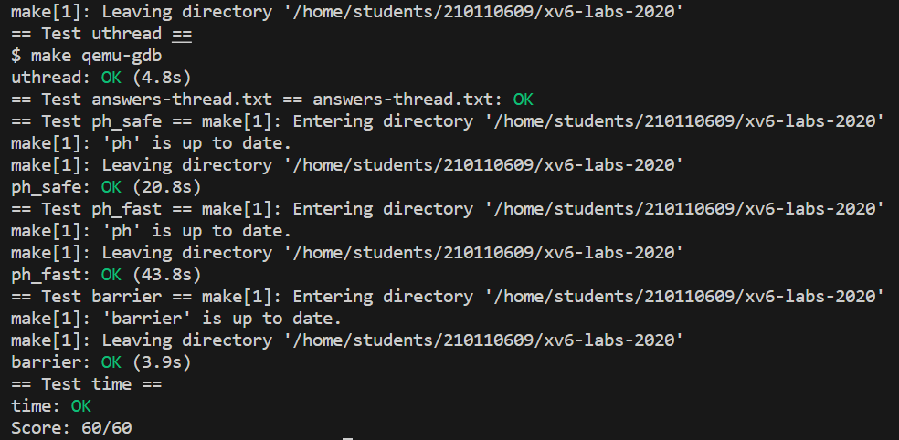

## 背景知识

### XV6 多线程

XV6的多线程的并行运行：首先线程会运行在所有可用的CPU核上，其次每个CPU核会在多个线程之间切换，线程数会远远多于CPU的核数。

不同线程系统之间的一个主要的区别就是，线程之间是否会共享内存。一种可能是，多个线程都在一个地址空间内运行，并且它们可以看到彼此的更新。当多个线程运行在一个共享地址空间时，需要用到锁。

XV6支持内核线程的概念，对于每个用户进程都有一个内核线程来执行来自用户进程的系统调用。并且所有的内核线程都共享了内核内存。

XV6中的用户线程之间没有共享内存，你可以有多个用户进程，但是每个用户进程都是只拥有一个线程的独立地址空间。Linux允许在一个用户进程中包含多个线程，进程中的多个线程共享进程的地址空间，这会复杂很多。

### 线程切换

- **一些知识：**

> Robert教授：在XV6中，一个进程要么在用户空间执行指令，要么是在内核空间执行指令，要么它的状态被保存在 `context` 和 `trapframe` 中，并且没有执行任何指令。这里该怎么称呼它呢？你可以根据自己的喜好来称呼它，对于我来说，每个进程有两个线程，一个用户空间线程，一个内核空间线程，并且存在限制使得一个进程要么运行在用户空间线程，要么为了执行系统调用或者响应中断而运行在内核空间线程 ，但是永远也不会两者同时运行。

`pre-emptive scheduling` ：pre-emptive 的意思是，即使用户代码本身没有出让CPU，定时器中断仍然会将CPU的控制权拿走，并出让给线程调度器（抢占式）。与之相反的是`voluntary scheduling`。在线程调度中，定时器中断会强制的将CPU控制权从用户进程给到内核，这里是 `pre-emptive scheduling`，之后内核中用户进程对应的内核线程会代表用户进程出让CPU，这是 `voluntary scheduling`。

每一个内核线程都有一个 `context` 对象（就是一组寄存器，与`trapframe` 类似，其只与内核线程相关）。但是内核线程实际上有两类。对于用户进程对应的内核线程，它的 `context` 对象保存在用户进程对应的`proc`结构体中。对于调度器线程，其没有对应的进程和`proc`结构体，所以 `context` 对象保存在CPU结构体中。在内核中，有一个CPU结构体的数组，每个CPU结构体对应一个CPU核，每个结构体中都有一个（调度器线程的）`context` 字段。

每一个CPU都有一个完全不同的调度器线程。任何运行在CPU上的进程，当它决定出让该CPU，它都会切换到该CPU对应的调度器线程，并由调度器线程切换到下一个进程。每一个调度器线程都有自己独立的栈。实际上调度器线程的所有内容，包括栈和 `context`，与用户进程不一样，都是在系统启动时就设置好的。

- **xv6进程P1切换到P2的详细流程：**

1. 一个定时器中断强迫CPU从用户空间进程切换到内核，`trampoline` 代码将用户寄存器保存于P1进程对应的 `trapframe`中
2. 在内核中运行`usertrap`，来实际执行相应的中断处理程序。这时，CPU正在进程P1的内核线程和内核栈上，执行内核中普通的C代码；
3. 假设进程P1对应的内核线程决定它想出让CPU，它会调用`swtch`函数（注：switch 是C 语言关键字，因此这个函数命名为`swtch` 来避免冲突）。从代码上，`swtch` 函数就是保存一个线程的context，再载入另一个线程的context。
4. 在`swtch` 函数中，其会直接切换到的是这个CPU对应的调度器线程，并在调度器线程的context下执行`schedulder` 函数
5. 在 `schedulder` 函数中会做一些清理工作，例如将进程P1设置成RUNABLE状态。之后再找到下一个RUNABLE进程P2，`schedulder` 函数会再次调用 `swtch` 函数。切换到P2进程对应的内核线程。
6. 因为进程P2在进入RUNABLE状态之前，如刚刚介绍的进程P1一样，必然也调用了 `swtch` 函数。所以之前的 `swtch` 函数会被恢复，并返回到进程P2所在的系统调用或者中断处理程序中（注，因为P2进程之前调用 `swtch` 函数必然在系统调用或者中断处理程序中）
7. 不论是系统调用也好中断处理程序也好，在从用户空间进入到内核空间时会保存用户寄存器到 `trapframe` 对象。所以当内核程序执行完成之后，`trapframe` 中的用户寄存器会被恢复。最后用户进程P2就恢复运行了。

### Sleep&Wakeup

- 锁的限制

  1. 从一个线程切换到另一个线程需要调用 `swtch` 函数，在调用 `swtch` 函数之前，要先获取线程对应的用户进程的锁，切换到调度器线程，在进程的线程完全停止使用自己的栈之后，调度器线程再释放进程锁。

     这么做的原因是，可以阻止其他CPU核的调度器线程在当前进程完成切换前，发现进程是RUNNABLE的状态并尝试运行它。否则，其他CPU核就有可能在当前进程还在运行时，认为该进程是RUNNABLE并运行它。两个CPU核使用同一个栈运行同一个线程会使得系统立即崩溃。

  2. 不允许进程在执行 `swtch` 函数的过程中，持有任何其他的锁。

     假设进程P1向进程P2切换，进程P1持有p->lock（也就是进程对应的proc结构体中的锁），还持有磁盘的锁。假设P2也想使用磁盘，它会对P1持有的磁盘的锁调用acquire。此时P2的acquire无法返回，而P1也无法继续执行磁盘操作释放锁，导致死锁。

  

- Sleep&Wakeup

  序列协调（sequence coordination），Sleep&Wakeup是一种典型的实现方式，它允许一个进程在等待事件时休眠，而另一个进程在事件发生后将其唤醒。

  如果一个线程需要等待某些事件，线程调用sleep函数并等待一个特定的条件。当特定的条件满足时，会发生中断并调用wakeup函数。当我们调用sleep函数时，我们通过一个sleep channel表明我们等待的特定事件，当调用wakeup时我们希望能传入相同的数值来表明想唤醒哪个线程。

  

- lost wakeup

  sleep函数还需要传入一个锁作为参数，否则可能导致lost wakeup。先介绍传入锁作为参数后整个Sleep&Wakeup的流程再解释为什么。

  在实际场景中，如 `uartwrite` ，首先获取了condition lock（实现对condition的互斥访问），之后检查condition，满足条件后在持有condition lock的前提下调用了`sleep(channel, lock)`函数。此时没有condition lock，wakeup无法执行。

  在sleep函数中，在释放condition lock之前，先获取了进程的锁。在释放了condition lock之后，wakeup就可以被调用了，但是wakeup不能查看进程的状态。所以，在sleep函数中释放了condition lock之后，wakeup也还没有执行。

  在持有进程锁的时候，sleep函数将进程的状态设置为SLEEPING并记录sleep channel，之后再调用sched函数，这个函数中会再调用switch函数，此时sleep函数中仍然持有了进程的锁，wakeup仍然不能做任何事情。

  当我们从当前线程切换走时，调度器线程中会释放前一个进程的锁。所以在调度器线程释放进程锁之后，wakeup才能终于获取进程的锁，发现它正在SLEEPING状态，并唤醒它。

  

  **为什么不传入锁会造成lost wakeup**

  如果不把condition lock传入sleep持有，则在进入sleep函数前就要释放condition lock。这个时间点就有可能造成中断，并调用wakeup，但是无法保证当前进程已经进入SLEEPING状态。因此可能造成SLEEPING进程不被唤醒的场景，因为wakeup和中断已经发生过了，即lost wakeup。

  而上述流程可以防止lost wakeup，是严格限制两个锁的使用，以控制wakeup的发生时间。可以将两个锁的使用总结如下

  1. 调用sleep时需要持有condition lock，这样sleep函数才能知道相应的锁。

  2. sleep函数只有在获取到进程的锁p->lock之后，才能释放condition lock。

  3. wakeup函数需要同时持有condition lock和p->lock才能查看进程。

## lab

- Uthread: switching between threads
  - 添加代码到 `user/uthread.c` 中的 `thread_create()` 和 `thread_schedule()` ，以及 `user/uthread_switch.S` 中的 `thread_switch`
  
  - > 这里的“线程”是完全用户态实现的，多个线程也只能运行在一个 CPU 上，并且没有时钟中断来强制执行调度，故更接近协程coroutine
  
  - 大体模仿kernel的代码即可
  
- Using threads

  - 应用pthread线程库进行加速，与lab8中的命题比较像
  - 相同的桶才会出现覆盖确实的问题，给每个哈希桶上锁即可，思路与lab8中比较像

- Barrier

  - 屏障（Barrier）：应用程序中的一个点，所有参与的线程在此点上必须等待，直到所有其他参与线程也达到该点。
  - 类似sleep&wakeup的sequence coordination实现，根据提示不难解决

	

