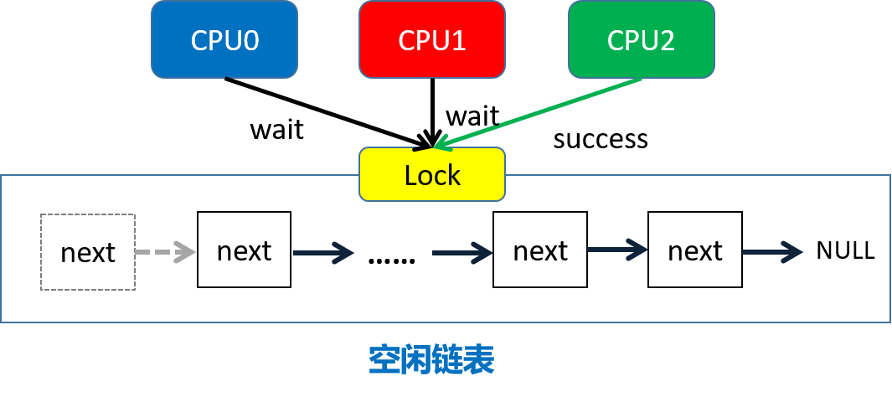
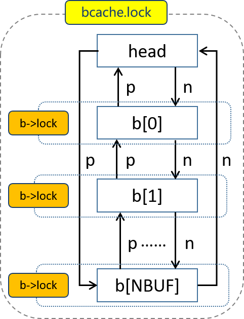
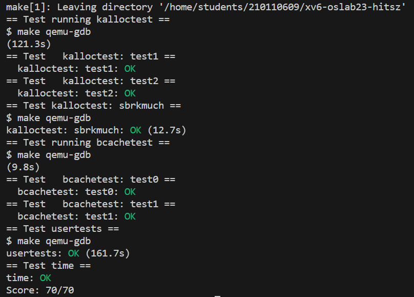

## lock

锁用来保证数据一致性的手段十分简单粗暴：当有人操作的时候，不允许其他人操作。

在多核情况下，这就会导致当很多CPU核心要操作一个数据结构（如`kalloc`中的`freelist`）时，需要排队，一个个来。一个核心在干活，其他的核心只能被阻塞住，这就导致了并行性的下降。但如果把锁删了，功能就不能保证正确了。功能正确的重要性往往比性能高的重要性大得多。因此在成熟的操作系统中，一般都会采取锁的机制，同时通过减少锁争用的方法优化性能。这是本实验的 **根本目的** ，之后的章节主要讨论使用锁的一些部件，我们在这些场景下来进行锁的优化。

## 内存分配器（Memory Allocator）

在xv6中，设置了总量为128MB的物理内存空间。xv6内存分配器对上层提供`kalloc()`和`kfree()`接口来管理这段剩余的空闲物理内存。在需要使用新内存空间的时候调用`kalloc()`，在需要释放内存空间的时候调用`kfree()`。物理内存分配器（allocator）定义在`kernel/kalloc.c`。

```c
struct run {
  struct run *next;
};

struct {
  struct spinlock lock;
  struct run *freelist;
} kmem;
```

分配器的核心数据结构是由空闲物理页组成的链表`freelist`，这个空闲页链表将物理内存划分成4KB大小的页帧来管理，并使用 **自旋锁** （spinlock）进行保护。每个空闲页在链表里都是`struct run next`指向下一个空闲物理页。

由于物理内存是在多进程之间共享的，所以不管是分配还是释放页面，每次操作`kmem.freelist`时都需要先申请`kmem.lock`，此后再进行内存页面的操作。

<div align="center">
	
</div>


**优化方法：**

减少锁的争抢， **使每个`CPU`核使用独立的链表** ，而不是现在的共享链表。这样等分，就不会让所有的`CPU`争抢一个空闲区域。**注意**：每个空闲物理页只能存在于一个`freelist`中。 

<div align="center">
	
</div>


## 磁盘缓存（Buffer Cache）

xv6的文件系统是以磁盘数据块为单位从磁盘读写数据的。由于对磁盘的读取非常慢，而内存的速度要快得多，因此将最近经常访问的磁盘块缓存在内存里可以大大提升性能。

数据结构`bcache`维护了一个由静态数组`struct buf buf[NBUF]`组成的双向链表，它以块为单位，每次读入或写出一个磁盘块，放到一个内存缓存块中（`bcache.buf`），同时自旋锁`bcache.lock`用于用户互斥访问。所有对缓存块的访问都是通过`bcache.head`引用链表来实现的，而不是`buf`数组。

```c
struct {
  struct spinlock lock;
  struct buf buf[NBUF];
  // Linked list of all buffers, through prev/next.
  // head.next is most recently used.
  struct buf head;
} bcache;
```

```c
struct buf {
  int valid;   // has data been read from disk?
  int disk;    // does disk "own" buf?
  uint dev;
  uint blockno;
  struct sleeplock lock;
  uint refcnt;
  struct buf *prev; // LRU cache list
  struct buf *next;
  uchar data[BSIZE];
};
```

每个缓存块（`struct buf`）都由三个部分组成：

- （1）**`data`字段** `（data[BSIZE]）`标示了它的内容;
- （2）**指针字段** `（\*prev，\*next）`用于组成链表;
- （3）**数值字段** 用于标示它的属性，如
  - *`valid`* 是缓存区包含了一个块的复制（即该buffer包含对应磁盘块的数据）;
  - *`disk`* 是缓存区的内容是否已经被提交到了磁盘;
  - *`dev`* 是磁盘块的设备号，本实验中dev都是0;
  - *`blockno`* 是缓存的磁盘块号;
  - *`refcnt`* 是该块被引用次数（即被多少个进程拥有）;
  - *`lock`* 是缓存磁盘块的睡眠锁。

<div align="center">
	
</div>


上图是`bcache`结构示意图。`bcache.lock`是自旋锁，用于表示 `bcache` 链表是否被锁住。`b->lock`是睡眠锁，用于表示缓存数据块`buf`是否被锁住。

在`kernel/bio.c`中，可以看到，所有的buffer都被组织到 **一条链表** 中，因此如果有多个进程要使用buffer，它们并发的请求只能被顺序地处理。

<div align="center">
	
</div>

**优化方法**

使用哈希桶，将各块块号`blockno`的某种散列值作为key对块进行分组，并为每个哈希桶分配一个专用的锁。通过哈希桶来代替链表，当要获取和释放缓存块时，只需要对某个哈希桶进行加锁，桶之间的操作就可以并行进行，提供并行性能。


<div align="center">
	
</div>
## lab

- 内存分配器

  修改内存分配器数据结构，将`kalloc`的共享`freelist`改为每个CPU独立的`freelist`；

  ```c
  struct run {
    struct run *next;
  };
  struct kmem{
    struct spinlock lock;
    struct run *freelist;
  };
  struct kmem kmems[NCPU];
  ```


- 磁盘缓存

  构建磁盘缓存数据结构，例如，可以构建13个哈希组；

  ```c
  #define NBUCKETS 13
  struct {
    struct spinlock lock[NBUCKETS];
    struct buf buf[NBUF];
    // Linked list of all buffers, through prev/next.
    // head.next is most recently used.
    //struct buf head;
    struct buf hashbucket[NBUCKETS]; //每个哈希队列一个linked list及一个lock
  } bcache;
  ```

  

<div align="center">
	
</div>
