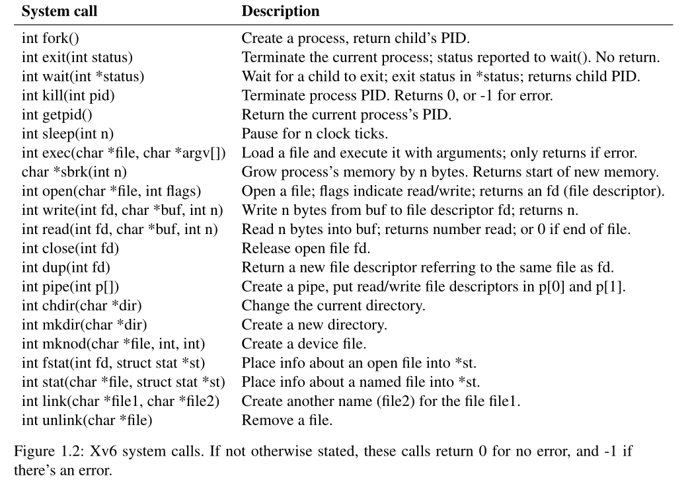

> Objectives
>
> 1. get familiar with xv6 and its system calls
> 2. use systems calls to write a few utilities

# pre-knowledge

## system calls

<div align="center">

</div>

其中较为重要的系统调用有`read, write, exit, open, fork, exec, wait`，以下是解释较难理解的系统调用

- `fork` ：拷贝当前进程的内存，并创建一个新的进程，这里的内存包含了进程的指令和数据。之后，我们就有了两个内存完全一样的进程。`fork` 系统调用在两个进程中都会返回，在原始的进程中会返回大于0的整数，这个是新创建进程的PID。而在新创建的进程中会返回 0。所以我们可以通过 `fork` 的返回值区分旧进程和新进程。
- `exec` ：从指定的文件中读取并加载指令，并替代（相当于丢弃）当前调用进程的指令。
- `wait` ：等待当前进程的子进程退出（exit），返回退出子线程的`PID`，并将 `exit` 的状态码写进传入的变量中 

以下是一段很好的示例代码，展现了以上系统调用

```c
#include "user/user.h"
//forkexec.c: fork then exec
int main(){
    int pid, status;
    pid = fork();
    if (pid == 0 ){
        char *argv [] = { "echo", "THIS", "IS", "ECHO", 0 };  //这里的0表示字符串结束
        exec("echo", argv );
        printf("exec failed ! \n");
        exit(1);
    } else {
        printf ( "parent waiting" );
        wait(&status);
        printf("the child exited with status %d\n", status);
    }
    exit(0);
}
// output:
//如果找到echo文件，则输出为：parent waiting \n THIS IS ECHO \n the child exited with status 0
//如果没找到，则输出为：parent waiting \n exec failed ! \n the child exited with status 1
```

代码中，子进程从第7行开始，子进程会用 `echo` 命令来代替自己，`echo` 执行完成之后就退出。之后父进程重新获得了控制。在第10行，`exit` 的参数是1，操作系统会将1从退出的子进程传递到第13行。`&status` 是将status对应的地址传递给内核，内核会向这个地址写入子进程向`exit` 传入的参数。

## I/O redirection

简单来说，利用 `fork` 和 `exec` 的分离，通过修改文件描述符对应的内容，把输入输出给截胡。进程从文件描述符0读入（标准输入），从文件描述符1输出（标准输出），从文件描述符2输出错误（标准错误输出）

以下是简化版的shell执行 `cat < input.txt` 的代码

```c
 char *argv[2];
 argv[0] = "cat";
 argv[1] = 0;
 if(fork() == 0) {
     close(0);
     open("input.txt", O_RDONLY);
     exec("cat", argv);
 }
```

子进程关闭文件描述符0后，`open`会使用0作为新打开的文件`input.txt`的文件描述符（创建文件描述符时会选用能用的最小整数）。之后 `cat` 将会在标准输入指向 `input.txt` 的情况下运行。

## pipe

管道提供一种**进程间**交互的方式。创建管道时，相当于以读方式和写方式**打开两次**同一个文件，这样就会返回两个不同的文件描述符，一个用来写，一个用来读。父进程fork出子进程时，子进程会拷贝父进程的文件描述符表，**所以子进程中也拥有刚刚打开的文件所对应的两个文件描述符**。由于管道**只能单向通信**，所以我们可以根据实际需要，确定关闭父进程的读端还是写端，确定关闭子进程的读端还是写端。

 以下代码展现了shell `echo hello world | wc`

```c
 int p[2];
 char *argv[2];
 argv[0] = "wc";
 argv[1] = 0;
 pipe(p);
 if(fork() == 0) {
     close(0);  // 关掉了0描述符
     dup(p[0]); // dup返回一个新描述符，由于0已经被关掉，返回0，即将标准输入绑定到了管道的读端口
     close(p[0]);
     close(p[1]); //重新绑定输入端口后把子进程的读写端都关掉
     exec("/bin/wc", argv);
 } else {
     write(p[1], "hello world\n", 12);
     close(p[0]);
     close(p[1]);  //父进程写入写端口后将所有端口关掉
 }
```

当管道读端读完管道中所有数据后，如果管道写端的文件描述符全部关闭，再次读会返回0，就像读到文件末尾一样。否则，如果写端的文件描述符没有全部关闭，再次读就会**阻塞**，导致子进程无法正常退出。这就是为什么我们在执行 `wc` 之前要关闭子进程的写端口。


# lab

- [x] sleep

  懂得怎么与 'shell' 交互即可，主要是搞懂 `main` 函数

- [x] pingpong

  需要用到两个 pipe ，深入理解 pipe 的单向通信

- [x] 

- [x] 

- [x] 

- [ ] 

通过测试，通过shell指令如 `./grade-lab-util sleep` 即可测试单个utility

```c
make: 'kernel/kernel' is up to date.
== Test sleep, no arguments == sleep, no arguments: OK (0.6s)
== Test sleep, returns == sleep, returns: OK (0.9s)
== Test sleep, makes syscall == sleep, makes syscall: OK (1.0s)
    
make: 'kernel/kernel' is up to date.
== Test pingpong == pingpong: OK (0.9s)
```

